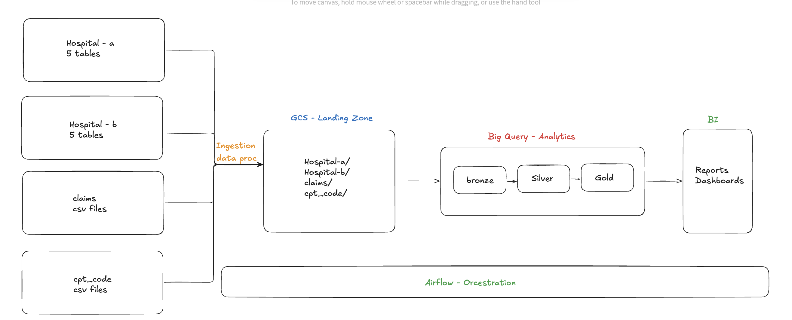

# HealthCare_GCP

**Agenda**

This project focuses on building scalable data lake in GCP for Revenue Cycle Management in the healthcare domain.

The primary objective is to centralize, clean, and transform data from multiple sources, enabling healthcare providers and insurance companies to streamline:
    Billing
    Claims processing
    Patient History
    Revenue tracking

**Project Architecture**

1. Data Sources: 
    - All the data from different sources that come from upstream (software engineers).  
    - These sources are the databases
2. Landing:
    - The data is ingested from the databases to the Google Cloud Storage.
3. Medillion Architecture:
    - Bronze:
        - The files are moved from the landing layer to the bronze layer.
        - This bronze layer is build on the BigQuery
    - Silver:
        - Slowly Changing Dimension (SCDs)
        - Common Data Model (CDM)
    - Gold:
        - Data Modeling
        - Visualization
4. Orchestration:
    - Schedule, orchestrate and manage pipelines.

Services:
- GCS: Store Raw and prcessed data
- BigQuery: Store, process, analyze the structured data
- Dataproc: Used for hadoop and Spark jobs (data processing, ingestion)
- Cloud COmposer: Airflow env (create and scedule DAGS)
- Cloud SQL: Store the transactional dbs
- GitHub: Store and version control
- CloudBuild: Automated deployment

Key:
1. Metadata-Driven Approch
2. SCD Type 2
3. Incremental Loading (Watermarking)
4. Common Data model (CDM)
5. Medallion Architecture
6. Logging and Monitoring
7. Error Handling
8. CI/CD
9. Automation
10. Optimization

Data sources:
1. EMR Data Sources - Cloud SQL Database
    - Stores data related to:
        - Patients table
        - Providers table
        - Departments table
        - Transactions table
        - Encounters table
    - There are two hospitals with sepearate dbs:
        - Hospital A -> hospital_a_db
        - Hospital B -> hospital_b_db

2. Claims Data Source
    - Comes from insurance companies
    - Provided as flat files
    - Stored in a designated folder in the data lake (landing zone) on a monthly bais.

3. CPT (Current Procedural Terminology) Codes:
    - A standardized system to describe medical, surgical, and diagnostic procedures.
